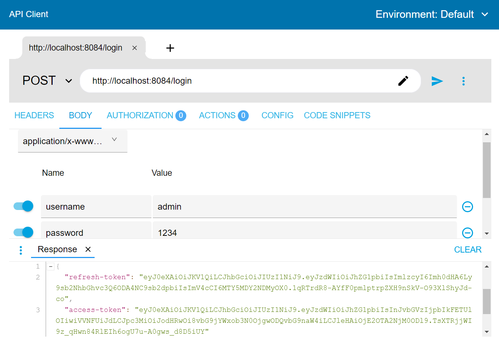
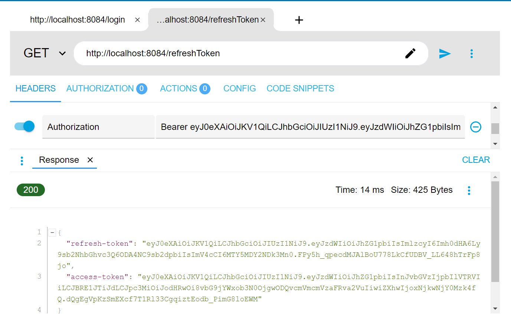
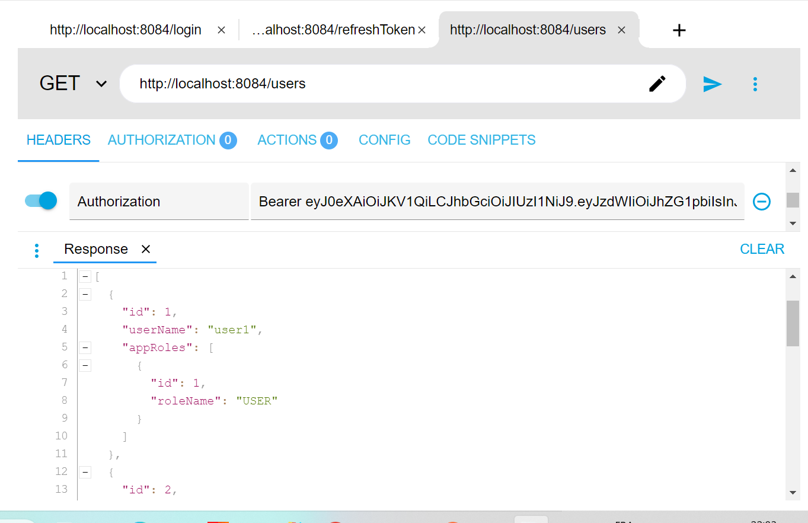

<h1>Compre rendu</h1>

<h4>Authentification de type Statless Spring Security avec JWT auth0 et l'algorithme de hachage HMAC {generation accesToken & refreshToken - Authorize les users }</h4>

<h4>Les depandances de projet :
- Spring Boot DevTools
- lombok
- Spring Web
- Rest Reposotories
- Spring Security
- Auth0 JWT
- Spring Data Jpa
- H2 Database
<h4>

<h4>Pour configurer l'auth de type statless, il faut crée deux filter

- filter JWT Authentication
- filter JWT Authorisation</h4>

<h5>. accesToken</h5>

<h5>. refreshToken</h5>

<h5>. listUser</h5>
